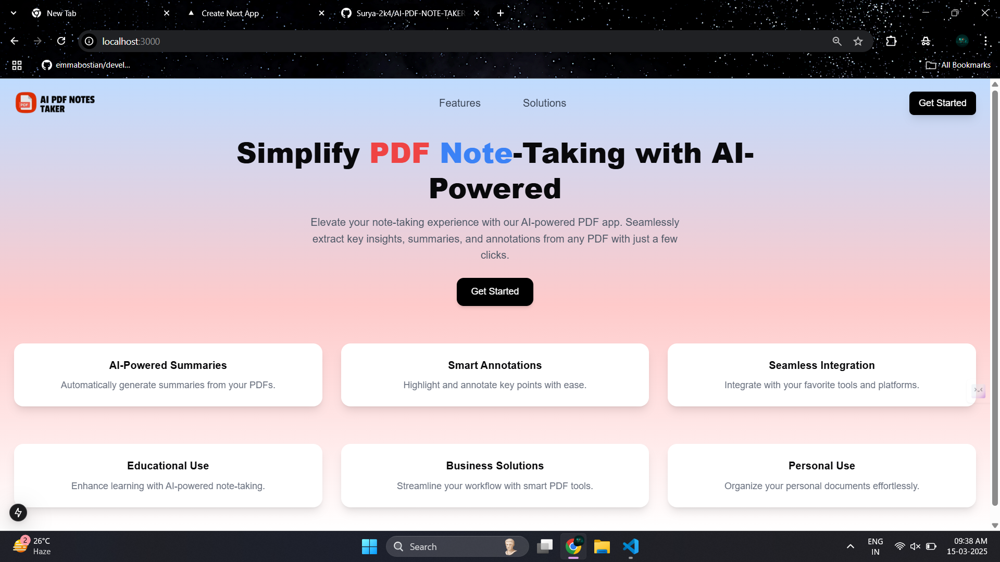
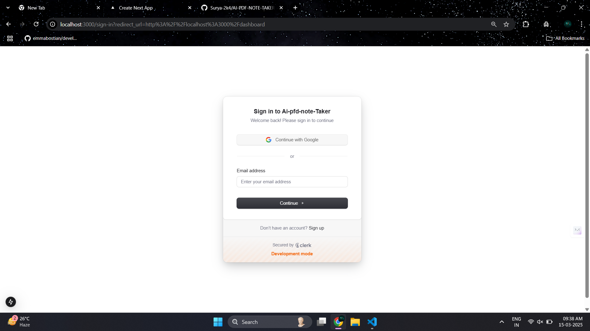
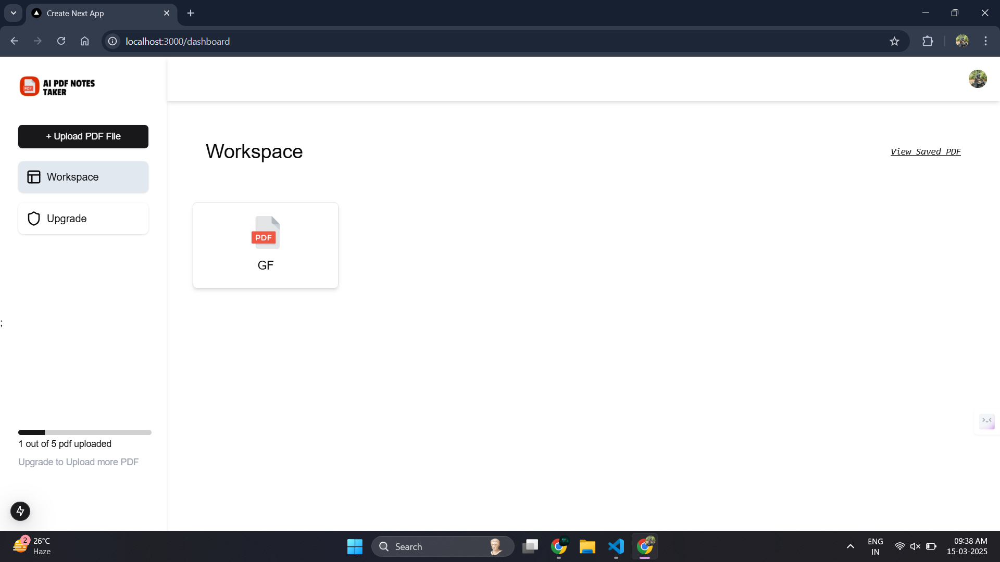
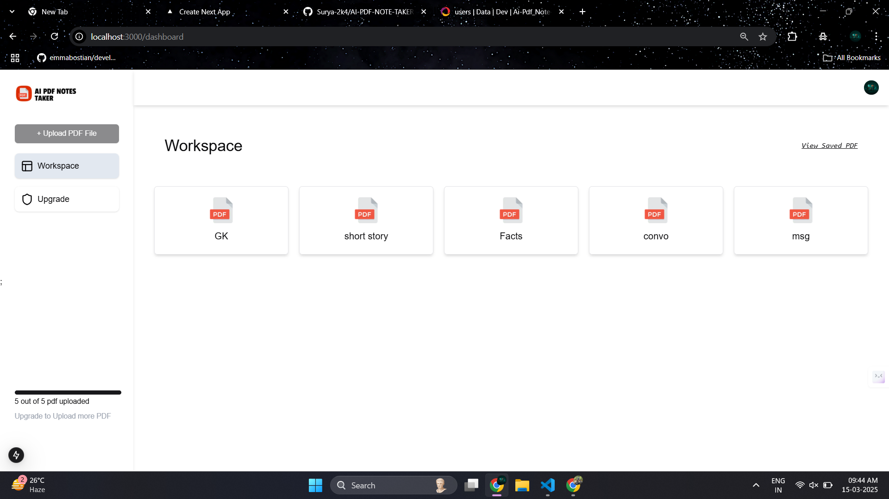
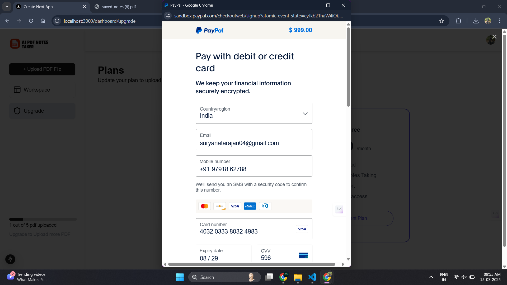
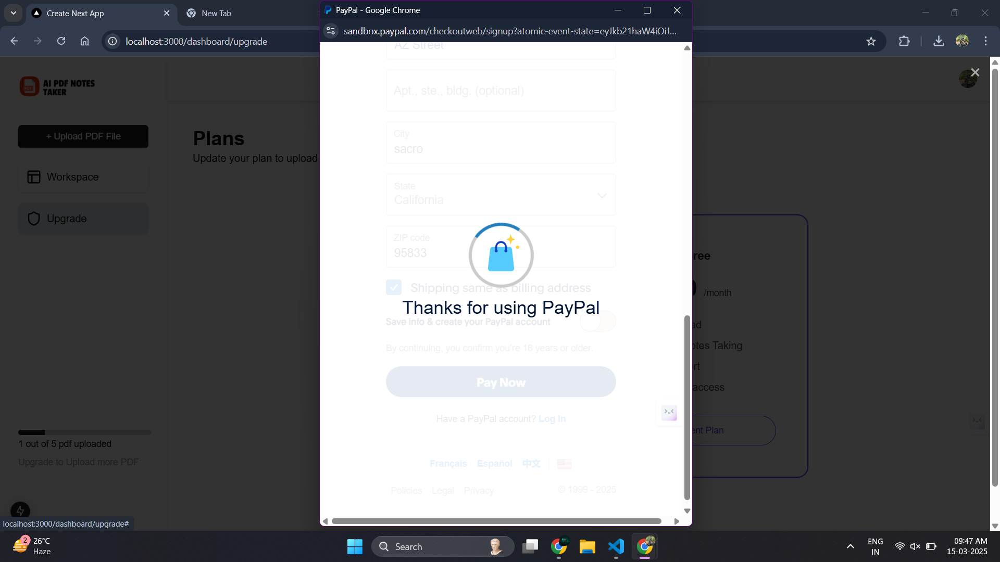
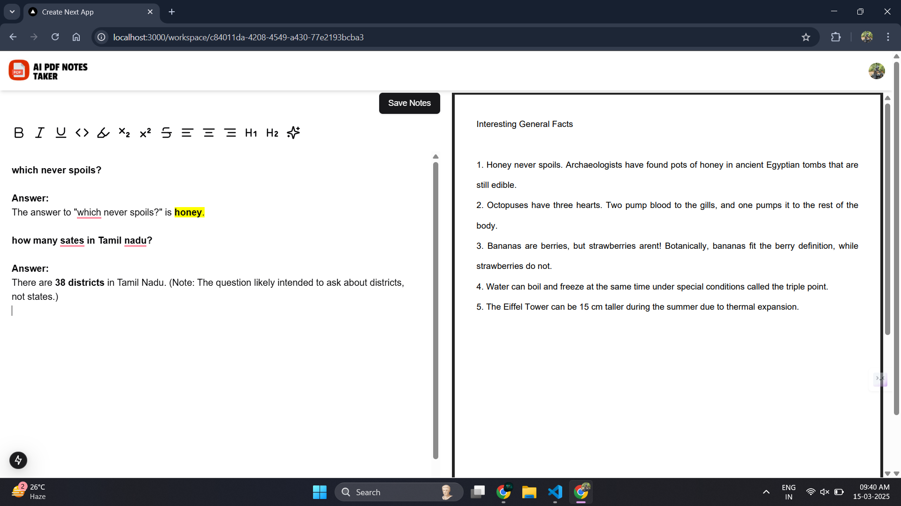
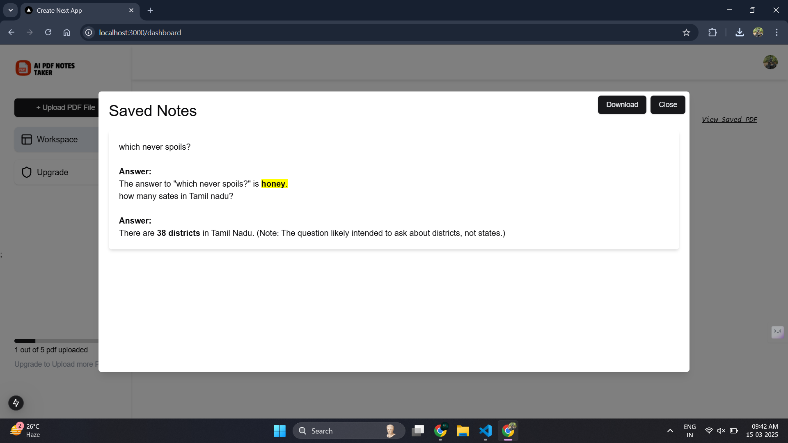
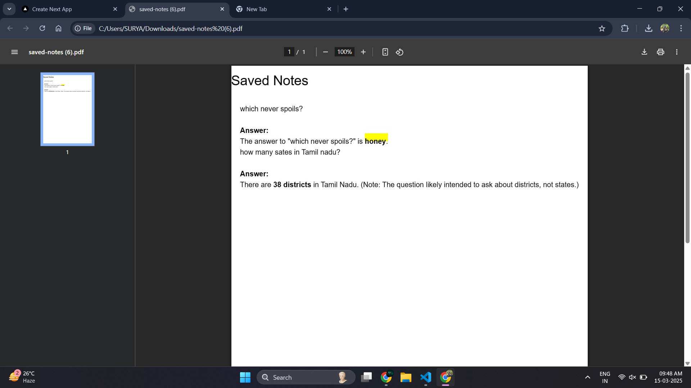

# AI PDF Note Taker

## 🚀 Overview
AI PDF Note Taker is a **Next.js-powered** web application that helps users **summarize, annotate, and extract insights** from PDFs using **AI-driven automation**. This tool enhances the note-taking experience with an intuitive UI, real-time collaboration, and secure authentication.

## ✨ Features

### 🔍 AI-Powered PDF Processing
- **Summarization**: Generate concise summaries of lengthy PDFs.
- **Key Insights Extraction**: Automatically extract important points from documents.
- **Question Answering**: Ask questions based on the PDF content and general knowledge using **Gemini API**.

### 📝 Interactive Note-Taking
- **Annotations**: Highlight, underline, and add comments to PDFs.
- **Smart Notes**: AI-generated notes based on document content.
- **Real-time Collaboration**: Share PDFs with team members for seamless collaboration.
- **Workspace Editor**: The left panel contains a text editor for interacting with the AI, while the right panel displays the PDF content.
- **Save Notes**: Save notes using the **Save** button, storing them in the database.
- **Export Notes**: Download saved notes as a PDF file using the **Save to PDF** button.

### 📂 File Management
- **Upload & Store PDFs**: Initially, users can upload up to **5 PDFs**.
- **Upload Limit**: Once the limit is reached, the upload button is disabled.
- **Upgrade for Unlimited Uploads**: Users can upgrade via **PayPal** to upload unlimited PDFs.
- **Dashboard Screen**: Uploaded PDFs are listed in the workspace.
- **PDF Navigation**: Clicking on a PDF opens the **workspace editor page**.
- **View Notes Section**: Lists all saved notes in the dashboard.

### 🔐 Secure Authentication
- **User Authentication**: Seamless login and registration using **Clerk**.
- **Role-Based Access**: Control access levels for different users.

### 💳 Monetization & Payments
- **Subscription Plans**: Upgrade for premium features using **PayPal integration**.
- **Pay-per-Use**: Enable one-time payments for AI-powered features.

### 🎨 UI/UX Enhancements
- **Modern UI**: Built with **Tailwind CSS** and **ShadCN** for a sleek design.
- **Dark Mode Support**: User-friendly interface with light/dark themes.
- **Fast & Responsive**: Optimized for all devices using **Next.js**.

## 🛠 Tech Stack
| Technology | Usage |
|------------|--------|
| **Next.js** | Frontend Framework |
| **Node.js** | Backend Runtime |
| **Tailwind CSS** | Styling |
| **Convex DB** | Database |
| **Clerk** | Authentication |
| **PayPal** | Payment Integration |
| **Gemini API** | AI Processing |
| **ShadCN** | UI Components |

## 📸 Screenshots
Below are some visuals of the application:

### 🏠 Landing Page


### 🔑 Sign In


### 📂 Dashboard (Workspace)


### 🚫 Upload Limit Reached


### 💳 Payment Details


### ✅ Payment Successful


### 📂 Text Editor (Workspace)


### ✍️ Saved Notes


### 📄 Downloaded PDF


## 📌 Installation & Setup

```sh
git clone https://github.com/Surya-2k4/AI-PDF-Note-Taker.git
cd AI-PDF-Note-Taker
npm install
npm run dev
npx convex dev
```

## 🤝 Contributing
Feel free to submit issues or pull requests to improve the project.

---
🚀 **Start enhancing your note-taking experience with AI!**
